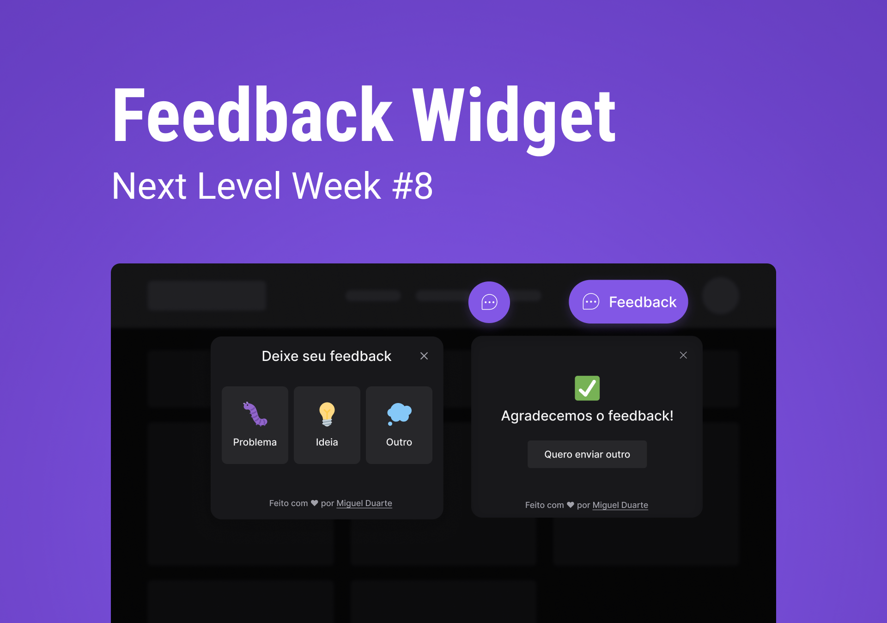

# RocketSeat | Next Level Week Return | Impulse

[Next Level Week](https://nextlevelweek.com) is a yearly event created by [RocketSeat](https://www.rocketseat.com.br/sobre).

The tech stack that they use the most is React, React Native and Node.

In this event, we created a widget to allow the users to send feedback and store in in a database.



# Layout

You can find the layout of this project [in this link](https://www.figma.com/community/file/1102912516166573468).

You must create a Figma account to access, view and duplicate.


# Technologies

### Web

- [React](https://www.typescriptlang.org/docs/)
- [Vite](https://vitejs.dev/guide/)
- [TypeScript](https://www.typescriptlang.org/docs/)
- [TailwindCSS](https://tailwindcss.com/docs/installation)
- [Axios](https://axios-http.com/docs/intro)

### Server

- [Node](https://nodejs.org/en/docs/)
- [Prisma](https://www.prisma.io/docs/)
- [Express](https://expressjs.com/en/starter/installing.html)


### Mobile
- [React Native](https://reactnative.dev/docs/getting-started)
- [Expo](https://docs.expo.dev/)

### Test and Deploy
- [Jest](https://jestjs.io/docs/getting-started)
- [Mailtrap.io](https://mailtrap.io/)
- [Railway](https://docs.railway.app/)
- [Vercel](https://vercel.com/docs)


# Setup

## Clone repository

Create a new directory to place the repository 

```bash
  cd my-directory
```

Clone the project

```bash
  git clone https://github.com/pncsoares/nlw-return-impulse-web.git
```

Go to the project directory

```bash
  cd nlw-return-impulse-web
```

## Start server

Open terminal and execute the following command:

```bash
  npm run dev
```

If you want to check the feedback database, run ```npx prisma studio```

## Start web application

Open terminal and execute the following command:

```bash
  npm run dev
```
You can now open ```http://localhost:3000/``` and test locally

## Start mobile

Open terminal and execute the following command:

```bash
  expo start
```
Then open on your mobile device or emulator

# Improvements checklist

- [ ] Dark/Light theme switch button
- [ ] Create feedback dashboard

# License

MIT